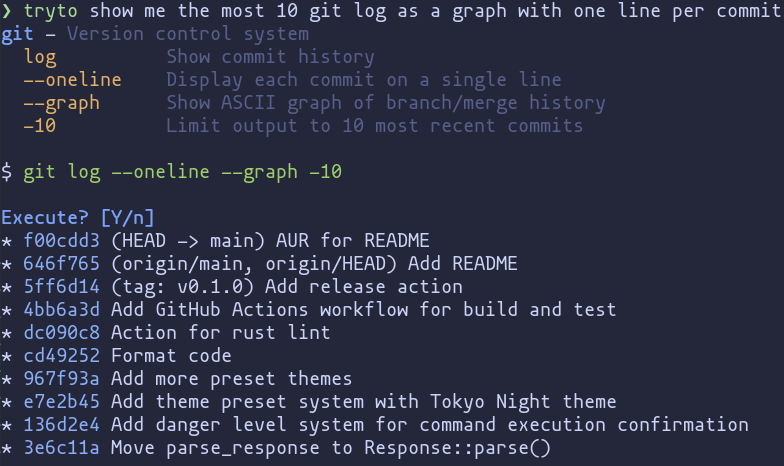

# tryto

> Describe your needs, shell like a guru.

Natural language to shell command converter powered by AI.



## Installation

### Pre-built binaries

Download from [GitHub Releases](https://github.com/beeender/tryto/releases).

### AUR (Arch Linux)

```bash
# Using yay
yay -S tryto-bin

# Or using paru
paru -S tryto-bin
```

## Quick Start

```bash
# Set up your AI provider
tryto setup

# Start converting natural language to commands
tryto find all PDF files modified in the last 3 days
tryto show me the git log as a graph with one line per commit
tryto compress this folder into a tar.gz archive
```

## Features

- **Natural Language Interface** - Type what you want in your own words
- **Multiple AI Providers** - Supports OpenAI, Anthropic, and more
- **Smart Command Generation** - Converts descriptions to precise shell commands
- **Safety First** - Danger level system warns before destructive operations

## Themes

```bash
# List available themes
tryto theme list

# Preview a theme
tryto theme preview catppuccin-mocha

# Set your favorite
tryto theme set tokyo-night
```

## Configuration

Configuration stored at `~/.config/tryto/config.toml`:
